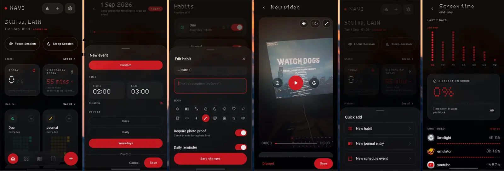

# NAVI

Habits, journal, schedule and focus — in one offline Android app.



## Features

- **Habits** — daily, weekday or custom schedules, rest periods, reminders, and optional photo proof on check-in.
- **Journal** — text entries with photos, video and voice notes, searchable, with a scrubbable waveform for recordings.
- **Schedule** — a day timeline you long-press to draw events on.
- **Focus & sleep sessions** — timed sessions with an app blocker for the apps you choose.
- **Screen time** — daily usage, most-used apps, and a distraction score built from your blocked list.
- **Backup** — export and restore everything as a single archive.

Everything is stored on-device. There are no accounts and no network calls.

## Install

Grab the latest APK from [Releases](https://github.com/notwewnothing/Navi/releases). Use `navi-<version>-arm64-v8a.apk` for most modern phones, or `navi-<version>.apk` if you're unsure.

## Build

```bash
flutter pub get
flutter build apk --release
```

Requires Flutter 3.44.1 or newer. Tagging a release (`git tag v1.0.0 && git push origin v1.0.0`) builds and publishes the APKs through GitHub Actions.
